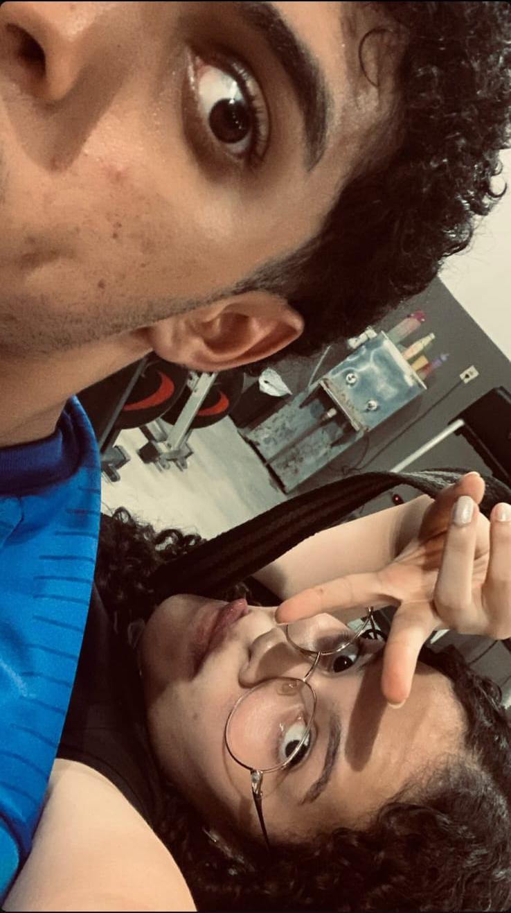

<!DOCTYPE html>
<html lang="pt-BR">
<head>
  <meta charset="UTF-8" />
  <meta name="viewport" content="width=device-width, initial-scale=1.0"/>
  <link rel="stylesheet" href="style.css">
   <link href="https://fonts.googleapis.com/css2?family=Great+Vibes&family=Poppins:wght@300;500;700&display=swap" rel="stylesheet">
</head>
<body>

  <header>
    <h1>Feliz Dia dos Namorados ❤️</h1>
    
Para minha digníssima ❤️

  </header>

  <section>
    <h2>Nossas lembranças:</h2>
  

    <figure>
      
      <figcaption>fazendo aquele treino monstro</figcaption>
    </figure>
    <figure>
      
      <figcaption>Eu e a diginissima</figcaption>
    </figure>
    <figure>
      
      <figcaption>Na praia juntos</figcaption>
    </figure>
  

    

      <h2>Para você...</h2>
     
Meu amor,

Desde o dia em que decidimos tentar de novo, minha vida mudou por completo.

Não consigo mais parar de pensar em você.

Em todo momento, o que mais quero é estar ao seu lado.

Meus pensamentos estão em você o tempo todo, e tudo o que eu mais desejo é te ver bem, feliz, sorrindo.

Você transformou a minha rotina, meus planos, o meu jeito de viver.

Estar com você faz a vida mais leve.

Te olhar, ver esse sorriso lindo, me traz uma paz que eu nem sabia que existia.

E os teus olhos… ah, teus olhos me hipnotizam.

Cada dia que passa, me vejo ainda mais apaixonado por ti.

Tenho vontade de dizer “eu te amo” várias e várias vezes sempre que estou com você — e isso nunca vai ser exagero.

Porque é exatamente o que eu sinto: <strong>amor verdadeiro</strong>, forte, constante.

Quero te fazer a mulher mais feliz desse mundo.

Quero te amar como Cristo ama a Sua igreja — com entrega, respeito, cuidado e propósito.

Desejo um relacionamento leve, cheio de conquistas, onde a gente se apoie, cresça junto e caminhe lado a lado, sempre de mãos dadas.

Quero ser o teu porto seguro, o teu refúgio, o teu lar.

E quero provar esse amor não só com palavras, mas com atitudes, com presença, com carinho diário.

Você é uma das maiores bênçãos que Deus me deu.

E eu sou grato demais por ter você na minha vida.

O seu sorriso ilumina até os meus dias mais difíceis.

Você é especial demais — perfeita no seu jeito, linda em cada detalhe.

Sou teu fã número 1, de coração.

Não existe mais ninguém pra mim.

É você. Sempre foi e sempre vai ser.

O meu coração é seu.

E toda vez que te vejo, é como se fosse a primeira vez — ele dispara, meus olhos brilham, e eu só consigo pensar que você é a resposta de todas as minhas orações.

Se tem algo que eu quero que você saiba com toda certeza do mundo é:

<strong>Você é tudo pra mim.</strong>

É com você que eu quero viver, crescer, sonhar, amar e caminhar todos os dias da minha vida.

Que você tenha um dia lindo e abençoado.

Fica com Deus.

Estarei sempre aqui, pra tudo o que você precisar.

<strong>Eu te amo profundamente.</strong>

Minha princesa, minha futura esposa, meu amor pra vida inteira. 🤍✨

    

    

  <h2>Versículo💖</h2>
  

    📖 <strong>1 Coríntios 13:4-7</strong> 
    O amor é paciente, o amor é bondoso. Não inveja, não se vangloria, não se orgulha. 
    Não maltrata, não procura seus interesses, não se ira facilmente, não guarda rancor. 
    O amor não se alegra com a injustiça, mas se alegra com a verdade. Tudo sofre, tudo crê, tudo espera, tudo suporta.
  

  

    📖 <strong>Cânticos 4:7</strong> 
    Você é toda linda, minha querida; em você não há defeito algum. 
  

  

     <h2> 𝄞 Musicas</h2> 
   Um amor tão puro… que ainda nem sabe a força que tem. É teu e de mais ninguém. Te adoro em tudo, tudo, tudo. Quero mais que tudo te amar sem limites, viver uma grande história, dessas que a gente escreve com o coração.

Diga pra mim que é real, que você também sentiu o que eu senti. Se disser, eu te prometo meu melhor. Porque quando olho pra você, vejo teu querer confesso, te queria a vida toda, sem precisar de estrada nenhuma. Só eu e você, aqui, no chão da sala, vivendo o agora.

Eu vejo você longe… e te quero perto. Fica na minha sombra, eu posso ser teu rastro. Não quero você pela metade. Quero tua boca na minha, tua vida colada na minha. Quero viver contigo esse amor sem filtros, sem medo, sem fim.

Se um dia eu te encontrar do jeito que sonhei, quem sabe a gente viva o que imaginei. Um altar, flores, véu e grinalda, lua de mel, chuva de arroz… e tudo depois. Ninguém mais feliz do que nós dois. A dama de honra pega o buquê, e eu pego tua mão, pra nunca mais soltar.

Chega de fingir. Eu não tenho nada a esconder. Agora é pra valer — haja o que houver. Não tô nem aí pro que dizem. Eu só quero ser feliz… e viver pra ti. Pode me abraçar sem medo. Pode encostar tua mão na minha. Meu amor, deixa o tempo se arrastar sem fim. Não há mal nenhum em gostar assim.

Você me traz tanta leveza que às vezes nem sei se estou no chão ou no ar. O nosso amor tem cheiro de mar, tem tons de verde-água sem fim. Tem o sossego de um fim de tarde, tomando um cházim, ouvindo Lagum tocar.

E com suas mãos segurando as minhas, e os nossos pés firmados sobre a rocha… então prosseguiremos. Porque o amor é isso: verdade, entrega e caminho. E eu quero tudo isso com você.

    

     
        <h2>Eu te amo em várias línguas 🌍</h2>
      

        Português: Eu te amo 
        Inglês: I love you 
        Espanhol: Te amo 
        Francês: Je t'aime 
        Italiano: Ti amo 
        Alemão: Ich liebe dich 
        Japonês: 愛してる (Aishiteru) 
        Coreano: 사랑해요 (Saranghaeyo) 
        Chinês: 我爱你 (Wǒ ài nǐ) 
        Árabe: أحبك (Uḥibbuka/Uḥibbuki) 
        Russo: Я тебя люблю (Ya tebya lyublyu)
      

    

  

  </section>

  <footer>
    <b>Feito para você — Feliz dia dos Namorados, minha princesa!!</b>
  </footer>

body {
      margin: 0;
       font-family: 'Poppins', sans-serif;
      background: #fff0f5;
      color: #333;
       background-image: url('amor.png'); /* caminho da sua imagem */
      background-size: cover; /* faz a imagem cobrir toda a tela */
      background-repeat: no-repeat; /* evita repetição da imagem */
      background-position: center; /* centraliza a imagem */
    }

    header {
      text-align: center;
      padding: 80px 20px 40px;
      background: linear-gradient(to right, #940005, #c40101);
    }

    header p{
      color: #fff;
    }

   header h1 {
      font-family: 'Great Vibes', cursive;
      font-size: 3.5em;
      color: #fff;
    }

    section {
      padding: 30px 20px;
      max-width: 1000px;
      margin: auto;
    }

    .fade-in {
  opacity: 0;
  animation: fade 2s ease forwards;
}

@keyframes fade {
  to {
    opacity: 1;
  }
}

    .photos {
      display: grid;
      grid-template-columns: repeat(auto-fit, minmax(200px, 1fr));
      gap: 15px;
      margin-top: 20px;
    }

    .photos img {
      width: 100%;
      height: 75%;
      border-radius: 10px;
      box-shadow: 0 4px 8px rgba(0,0,0,0.2);
    }

    
    .text-content {
      background: #ffe4e1;
      padding: 20px;
      border-radius: 10px;
      margin-top: 30px;
      box-shadow: 0 2px 6px rgba(0, 0, 0, 0.1);
    }

    .bible-verses {
  background: #fff5f8;
  padding: 25px;
  border-radius: 12px;
  margin-top: 40px;
  box-shadow: 0 3px 8px rgba(0,0,0,0.1);
}

.bible-verses h2 {
  text-align: center;
  color: #d63384;
  margin-bottom: 20px;
}

.bible-verses h3 {
  text-align: center;
  color: #d63384;
  margin-bottom: 20px;
}

.bible-verses p {
  font-size: 1.1em;
  line-height: 1.6;
  margin-bottom: 20px;
}

    .languages {
      margin-top: 40px;
      text-align: center;
    }

    .languages h2 {
      margin-bottom: 15px;
      color: #ff4b91;
    }

    .languages p {
      font-size: 1.2em;
      line-height: 1.6;
    }

    footer {
      background: #a70000;
      text-align: center;
      color: #ffe4e1;
      padding: 20px;
      margin-top: 40px;
      font-size: 0.9em;
    }

    
.heart {
      position: fixed;
      top: -50px;
      font-size: 24px;
      color: #ff6699;
      animation: fall 6s linear infinite;
      opacity: 0.8;
      z-index: 999;
    }

    @keyframes fall {
      0% {
        transform: translateY(-100px) rotate(0deg);
        opacity: 1;
      }
      100% {
        transform: translateY(100vh) rotate(360deg);
        opacity: 0;
      }
    }
